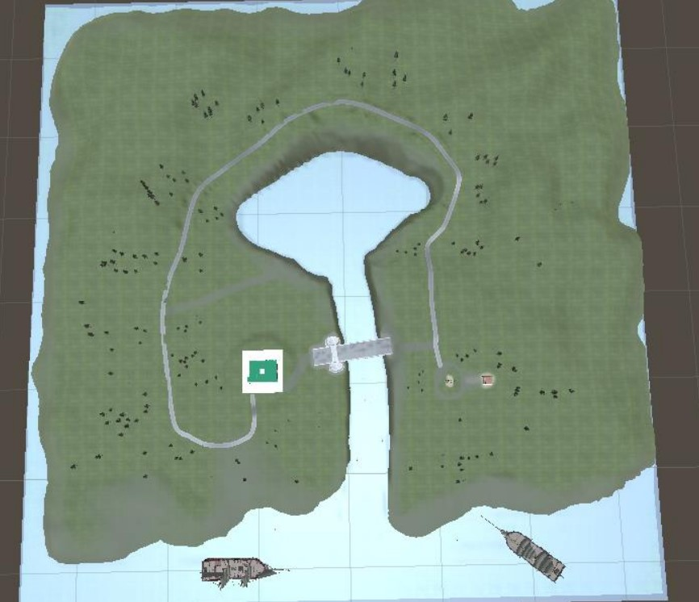
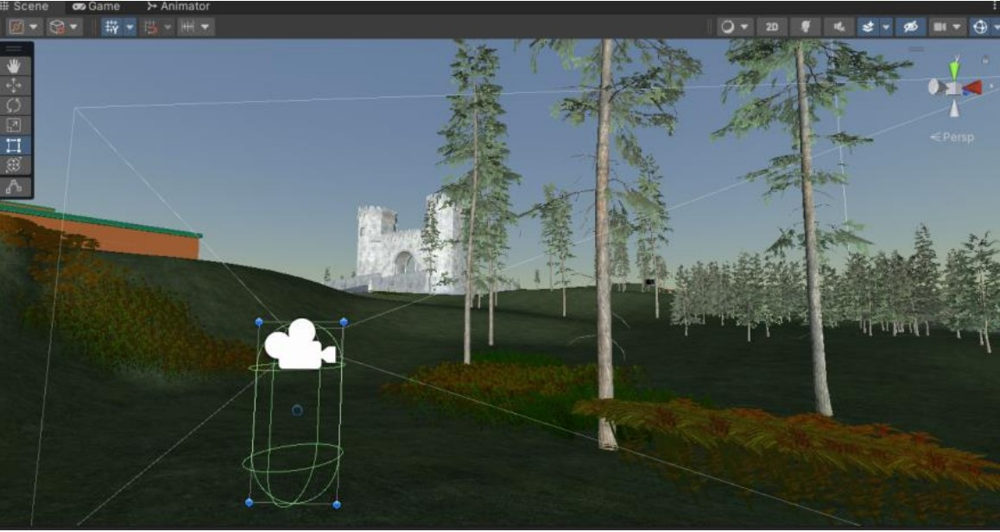
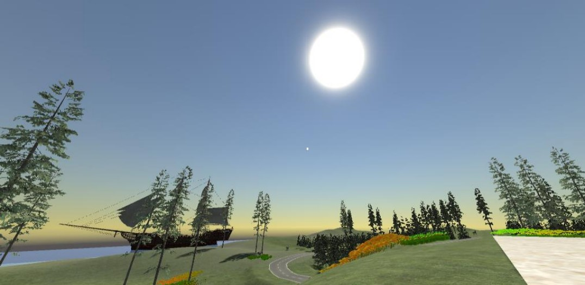
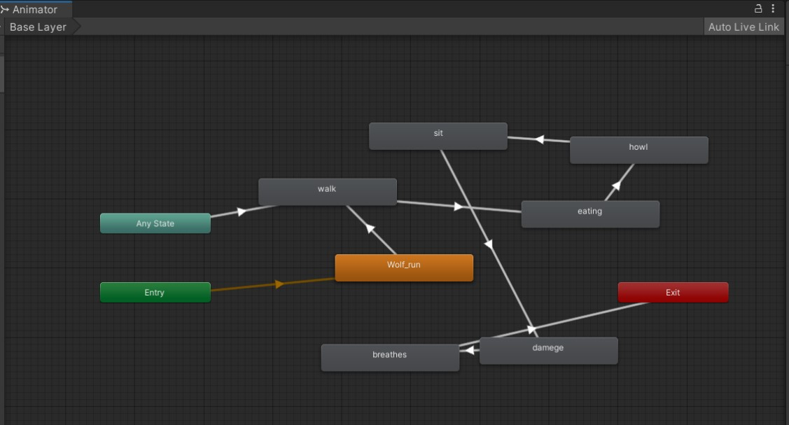
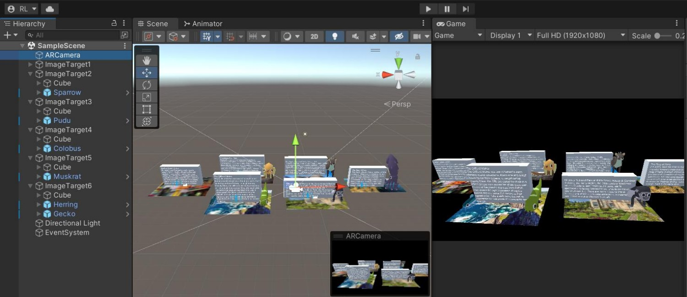
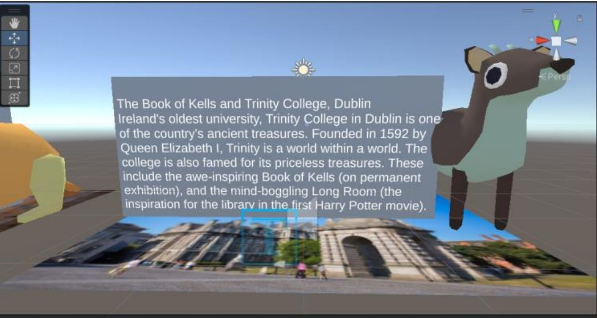
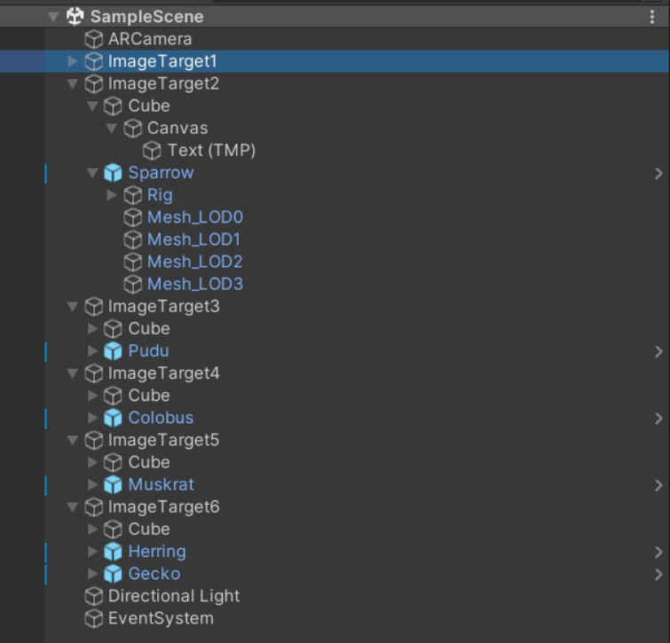
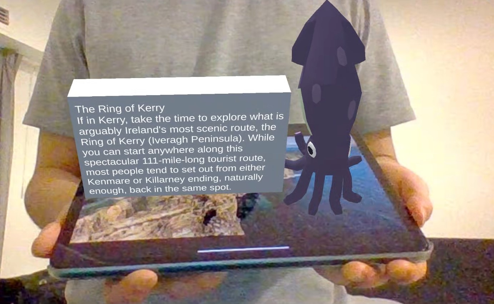

# 3D-Interactive-Production-and-AR-Design
 This 3D product is named The Island, an interactive scene built based on the Unity 3D environment. It can be developed into a game-type product. About the AR interactive product, I make it as an image target application.  

# Overview
## 3D Interactive Environment design and production
This interactive scene is a small island, on which there is an Irish landscape exhibition hall and many beautiful landscapes, such as small zoo, ancient ruins, forests and lakes, etc. The main map of The Island is shown below:

In this small island scene, the player's operation is simple and clear, and the player's gameplay is to explore and appreciate the small island. Player need to use some keys on keyboard: the W, A, S, D keys to control the run direction and the space to jump and the shift to accelerate and the ctrl to squat down and the mouse to control the perspective, then experience and play the entire interactive scene. After the player completes the island experience, press the exit key on the keyboard to exit the scene.

First-person control mode setting: In order to allow players to explore and play in the environment from a first-person perspective, I found the relevant first-person controller asset from the Unity Asset Store. After downloading and importing it into the scene, adjust the height of the first-person camera to Adapt to the appropriate character height in the scene, adjust the position of the first-person controller, and set the correct starting point for the scene experience. The first person controller model is shown in the figure below:

Skybox and lighting setting: Use the Rendering light in the window column to set the skybox of the entire scene. Create a new 3D object, set it as skybox material, set this 3D object, adjust sky tint, exposure and sun size convergence, etc., so that the skybox shows the ideal effect. The visual effect of Skybox is shown in the figure below. Regarding the lighting settings of the scene, I applied my own lighting settings to make this scene achieve a suitable lighting effect

Since the 3D environment is interactive, there are many animations design included in the scene, here is an example of the animator design as shown below, it's the wolf animator design diagram:

An overall background music is set in this scene, which corresponds to the content of the scene. The theme of this interactive scene is closely related to themes such as natural scenery, animals and plants, and cultural relics, so in the selection of background music, I mainly selected around the above themes, and finally selected a piece of music called mountain path as Background music. Create a 3D Object and attach the selected background music to it as a component, and the setting of the background music is completed. When the player enters the game, the background song sounds slowly, making the content of the visual scene to be explored and the background music linked to each other, forming an interactive effect, which effectively improves the player's sense of atmosphere and fun when exploring the scene.

## AR Interactive Environment design and production 
In this project, I used the image target application to design an interactive AR application about the promotion of famous Irish attractions. I set up several very famous scenic spots in Ireland, with commentary text and commentary audio, and matched with cute and exquisite 3D animal models. Users of the AR application can obtain detailed introductions of these scenic spots by displaying some pictures of beautiful scenery in Ireland, including text and voice. This AR interactive design application helps tourists who want to visit Ireland's beautiful attractions to further understandvarious attractions in Ireland. The design interface of this AR application in Unity is shown in the figure below:

Using this interactive AR project with image target technology as the core, users can display any form of picture (whether it is an electronic image or a printed image) in front of the camera. After the camera extracts and inputs the image into the application, it will It will recognize according to the image features, and when the target image is found, the corresponding animation model and explanatory text will be displayed, accompanied by the corresponding English introduction. The image target model is shown as the picture below:

 
For the design of the entire image target AR application, I first adjusted the corresponding settings of unity and entered the packages that need to be used, such as the AR engine and other assets. Then add AR camera to the project, making the camera application of external ports possible. Then enter all target images on the Vuforia website to make a corresponding dataset. Then enter it into unity. Create an imagetarget object in the project, and set each image in the dataset to a different target images. Place the input model in these imagetargets, and create a cube object to be used as the background board for the subtitles. Create commentary text and place it on each cube. Finally, add the externally input commentary sound effect as an audio source to each imagetarget component, and set the corresponding trigger function to trigger playback when the target image is detected, and stop playback after the target image disappears. The hierarchy of the AR project is shown in the figure below:

The application demonstration of this AR interactive product is shown in the figure below:

